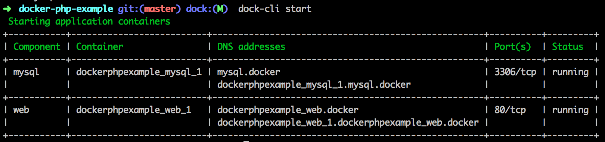

# Dock CLI

[](https://scrutinizer-ci.com/g/sroze/dock-cli/?branch=master)
[](https://scrutinizer-ci.com/g/inviqa/dock-cli/build-status/master)

This CLI application provides an abstraction layer for Docker-based projects.

**Note:** right now, it's focused on OSX and Debian-based Linux distributions.

## Getting started

This tool also helps you to install our recommended Docker setup on your computer, including direct container routing
and DNS resolutions.

Read [the installation instructions](docs/install.md).

## Project-related usage

You can now start up a specific project by running the [`start` command](docs/cmd-start.md) in the project directory:
```
dock-cli start
```

Once the containers are compiled and started, this start command will display you an overview of the running components
and their addresses (that you can also to have later with the [`ps` command](docs/cmd-ps.md)).


*Example output using the [`docker-php-example` project](https://github.com/sroze/docker-php-example)*

## Commands

The following commands are available:

### System commands

- [`docker:install` command](docs/cmd-docker-install.md) sets up your Docker development environment.
- [`docker:restart` command](docs/cmd-docker-restart.md) restarts your Docker VM.
- [`docker:doctor` command](docs/cmd-docker-doctor.md) diagnoses problems with Docker setup and attempts to fix them.

### Project commands

- [`start` command](docs/cmd-start.md) starts the Docker environment for the project.
- [`stop` command](docs/cmd-stop.md) stops the running Docker containers of the project.
- [`ps` command](docs/cmd-ps.md) list all the project containers if any.
- [`logs` command](docs/cmd-logs.md) follows the logs of all or a given container.
- [`run` command](docs/cmd-run.md) run a command in a container with the application context.

## Update

To update this tool, simply run the `self-update` command:

```
dock-cli self-update
```

## Contributing

**Note** If you are cloning this repository then one of the packages included in the vendors
requires the ssh2 PHP extension. If you do not have this installed and do not require the
associated functionality then you can ignore this requirement when installing the vendors:

```
composer install --ignore-platform-reqs
```
